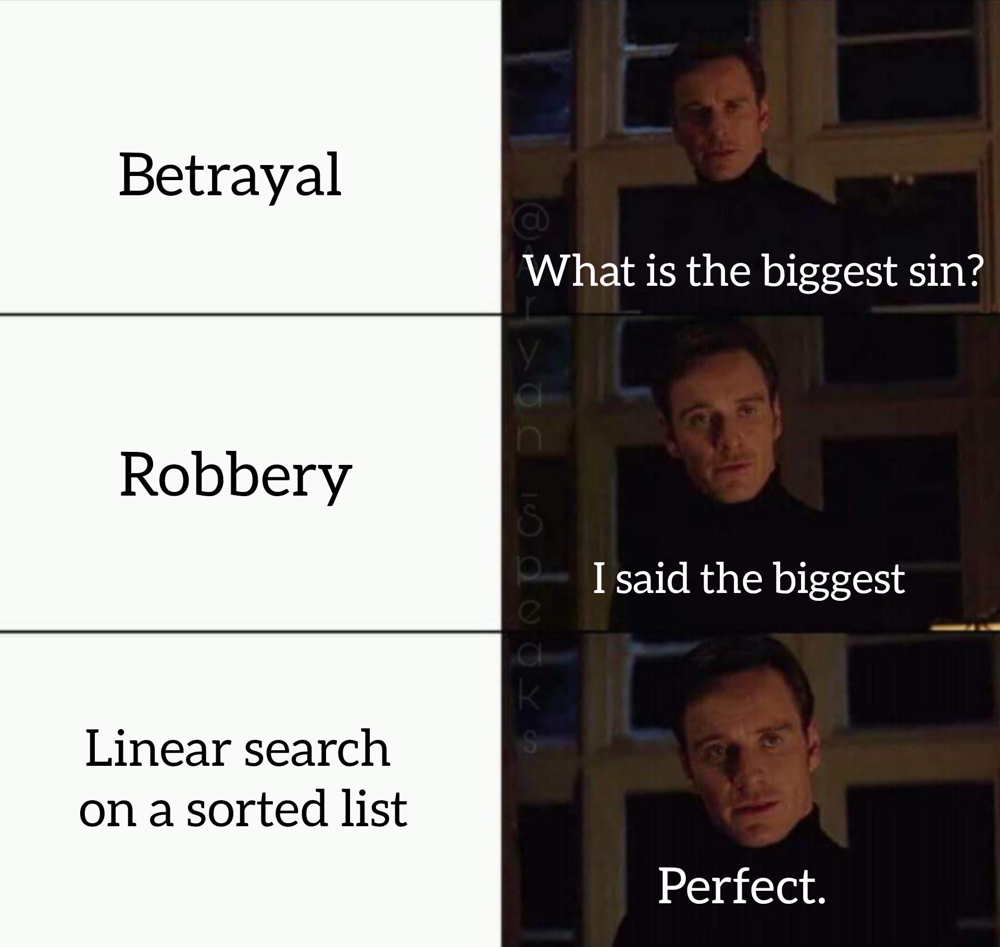

# [Binary Search](https://en.wikipedia.org/wiki/Binary_search)

The binary search algorithm.

## Getting started

    npm i; npm run start

Testing with `vitest`

    npm run test

`NOTE:` You can just use **bun** to run *.ts* files without doing `npm i`.

## Until next time...

## ;)
